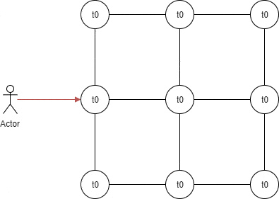
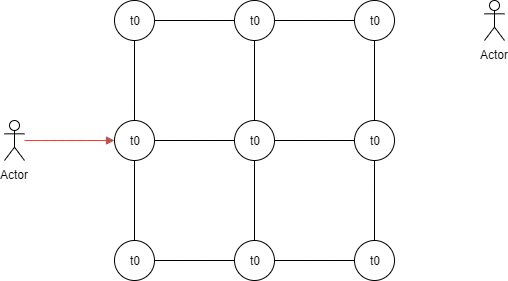
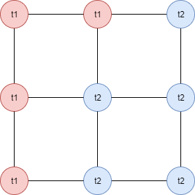

Experimentation with gossip protocols
=====================================

This repository contains a sample implementation of a gossip protocol for experimentation purposes.

__DISCLAIMER__: this repository is for experimentation purposes only with the goal of learning about and playing with gossip protocols. This is not and will not be production-ready at any point in time. Do not use this in production.

* [Usage](#usage)
* [Design considerations](#design-considerations)
* [Components](#components)
* [How it works](#how-it-works)

## Usage

### Data nodes

__Start a data node__

```bash
cd node/
# Set environment variables
export GOSSIP_IP=127.0.0.1
export GOSSIP_PORT=8080
go run .
```

__Push a new data state__

```bash
curl -X POST -d '{"data": "Hello, world"}' http://$GOSSIP_IP:$GOSSIP_PORT
```

__Retrieve latest known data state__

```bash
curl http://$GOSSIP_IP:$GOSSIP_PORT
```

__Retrieve the list of peers__

```bash
curl http://$GOSSIP_IP:$GOSSIP_PORT/peers
```

__Add a peer__

```bash
curl -X POST -d '{"ip": "127.0.0.1", "port": 8081}' http://$GOSSIP_IP:$GOSSIP_PORT/peers
```


### Controller nodes

__Start a controller node__

```bash
cd control/
# Set environment variables
export GOSSIP_IP=127.0.0.1
export GOSSIP_PORT=7080
go run .
```

__Retrieve the graph of data nodes__

```bash
curl http://$GOSSIP_IP:$GOSSIP_PORT/peers
```

__Add a data node__

If there are other nodes peered to that one, they will be automatically discovered by the scheduled scan operation from the controller node.

```bash
curl -X POST -d '{"ip": "127.0.0.1", "port": 8080}' http://$GOSSIP_IP:$GOSSIP_PORT/peers
```

## Design considerations

This implementation was built with the following considerations in mind:

* __Everything fails__: Any component in the system should not make assumptions concerning the availability of other components. They should instead test the availability of other components at regular interval.
* __AP architecture__: This system will put availability and partition tolerance above consistency. All data nodes should be able to handle read and write requests at all time, as long as they are reachable and functioning properly. Data nodes should still be able to accept read and write in case of network partition. As these partitions are rare occurences, time to consistency in case of a partition can be high.
* __Sparse graph__: Every data node in the system should only be connected to a few other data nodes. Data propagation should be handled through a [gossip protocol](https://en.wikipedia.org/wiki/Gossip_protocol).
* __No data in the control plane__: Controller nodes should not have access or need to read the data state in different nodes. They should only ensure [graph connectivity](https://en.wikipedia.org/wiki/Connectivity_(graph_theory)).
* __Simple data nodes, smart controllers__: Most of the complex and compute-intensive logic should be handled by the controller nodes. The data nodes should only be preoccupied with checking availability of their peers and that they have the latest known data state.

## Components

The system is made of two different types of components: __data nodes__ and __controller nodes__.

* __Data nodes__ store data information, respond to data read and write requests, and propagate data to their peers.
* __Controller nodes__ scan the entire graph of data nodes, check if there are no partition across the graph, take preventive actions against network partition, and report on the graph structure.

## How it works

### Data propagation

<p align="center">
  
</p>

__1. Receving a new data state__

When a data node receives a new state from an end-user, it will add a timestamp in nanoseconds, which will become the unique identifier for that piece of information.

While using a timestamp could lead to a risk of collision, the probability of a collision is low enough for low amount of write per seconds. The data nodes also only support storing a single piece of information at a time, which does not allow complex data manipulation, atomic counters, etc.

__2. First step of propagation__

The data node that received that piece of information then sends it to all its peers.

As the piece of information now contains a timestamp, the peers can check it against their internal state. If the internal state contains a timestamp equal or higher than the one received, they ignore the message.

__3. Second step of propagation__

If the piece of information is newer than the internal state, the peers of the first data node send that information to all their peers as well.

As the first node is also a peer of these peers, the first node will receive the information again. However, as the timestamp will match the one in the first node's internal state, the message will be discarded.

When a message is discarded, it is not propagated to the peers, which prevents nodes sending the same message over and over again throughout the network.

__X. Rinse and repeat__

The new piece of information keeps propagating throughout the network until all reachable nodes have received it or until a newer state version propagates.

### Data propagation with multiple versions

<p align="center">
  
</p>

When they receive a new state, nodes look at the state timestamp and compare it with the internal state timestamp. If the received state is older than the current state, the node discard that message. This ensures that nodes will end up with the latest available state.

### Heartbeats

<p align="center">
  
</p>

At regular interval, data nodes will retrieve status information from their peers.

This information contains the timestamp, but not the data itself. This prevents sending large amount of data in case the state is very large.

Then, the node will compare that timestamp against its internal state. If the peer's timestamp is greater, it will fetch the information from that peer, update ts internal state and propagate the updated state. Propagating the state ensures a faster recovery from a network partition.

If a network becomes separated in two disconnected graphs, then reconnect through a pair of peers, these two peers will fetch the status from the other one. If any message propagated through one of the graph, but not the other, the peers will be able to self-update, then will forward the message to the disconnected graph that did not get the latest state update.

### Partition recovery

There are multiple recovery scenarios from a network partition, depending on its duration.

In case of a short partition, the heartbeat mechanism inside nodes will automatically fetch the latest state and propagate it.

In case of a long partition, the nodes will consider peers on the other side of the partition as irrecoverable. After an even longer period of time, the controller will also consider these nodes irrecoverable. If network recovery happens between these two periods, the controller's routine scan will detect that the graph is not fully connected anymore and send peering requests to nodes to re-establish the graph. Once this is done, peers on the edge will perform heartbeats which will help recover and propagate the latest state.

In case of a partition so long that the controller nodes consider the nodes as irrecoverable, the network must be manually reconnected by sending a `POST /peers` call to the controller node with one of the nodes that were considered irrecoverable. The controller's routine scan will automatically discover the other nodes in that graph. If there are multiple partitions, you will need to manually add one node from each disconnected graph.